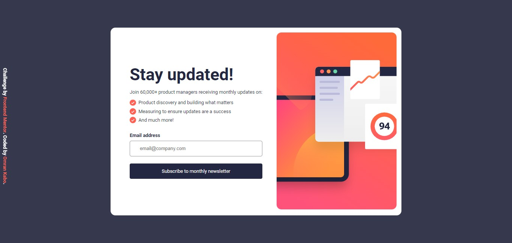

# Frontend Mentor - Newsletter sign-up form with success message solution




This is a solution to the [Newsletter sign-up form with success message challenge on Frontend Mentor](https://www.frontendmentor.io/challenges/newsletter-signup-form-with-success-message-3FC1AZbNrv). Frontend Mentor challenges help you improve your coding skills by building realistic projects. 

## Table of contents

- [Overview](#overview)
  - [The challenge](#the-challenge)
  - [Links](#links)
  - [Built with](#built-with)
  - [What I learned](#what-i-learned)
  - [Continued development](#continued-development)
- [Author](#author)

## Overview

### The challenge

Users should be able to:

- Add their email and submit the form
- See a success message with their email after successfully submitting the form
- See form validation messages if:
  - The field is left empty
  - The email address is not formatted correctly
- View the optimal layout for the interface depending on their device's screen size
- See hover and focus states for all interactive elements on the page


### Links

- Solution URL: [Add solution URL here](https://your-solution-url.com)
- Live Site URL: [Add live site URL here](https://your-live-site-url.com)

## My process

### Built with

- Semantic HTML5 markup
- CSS custom properties
- Flexbox

### What I learned

I learnt how to display responsive images with pictuer tag, and tried to ues class instead of regular java script and i'm quite impressed with the result.

```html
<picture class="image_con">
    <source media="(max-width:790px)" srcset="../assets/images/illustration-sign-up-mobile.svg">
    
</picture>
```

```js
class UI{
    constructor(app){
        this.app = app;
        this.dismissButton;
        this.submitButton;
        this.submitFormContainer;
        this.successMessage;
        this.value = '';
        this.state = 'inital';
    }
    CREATE_UI(){
        if (this.state === 'inital') {
            // contanier
            this.submitFormContainer = document.createElement('article');
            this.submitFormContainer.classList.add('container')
            this.submitFormContainer.innerHTML = inital_page;
            // form
            this.form = this.submitFormContainer.querySelector('.input');
            this.form.addEventListener('change',(e)=>{
                this.value += e.target.value;
                console.log(e.target.value);
            })
            // button
            this.submitButton = this.submitFormContainer.querySelector('.submit');
            this.submitButton.addEventListener('click',this.upload);
            this.app.appendChild(this.submitFormContainer);
            
        }else if (this.state === 'success') {
            this.successMessage = document.createElement('div')
            this.successMessage.classList.add('success_container')
            this.successMessage.innerHTML = succeessMassageCard;
            // button
            this.dismissButton =  this.successMessage.querySelector('.dismiss');
            this.dismissButton.addEventListener('click',this.dismiss)
            this.app.appendChild(this.successMessage)
        }
        
    }
    remove(){
        if (this.state === 'inital') {
            this.app.removeChild(this.successMessage)
            
        }else{
            this.app.removeChild(this.submitFormContainer)
        }
        this.CREATE_UI();
        
    }
    stateHandler(givenState){
        this.state = givenState;
    }
    upload = (e)=>{
        e.preventDefault()
        if (this.value) {
            this.stateHandler('success');
            this.remove();
            this.value = ''
        }
    }
    dismiss =()=>{
        this.stateHandler('inital')
        this.remove()
    }
}

```

### Continued development

I will remake it with react or nextjs with an api to collect emails and make it further more like a real project.

## Author

- Frontend Mentor - [@Omrankabo](https://www.frontendmentor.io/profile/Omrankabo)
- Twitter - [@kabo_omrans](https://twitter.com/kabo_omran)
